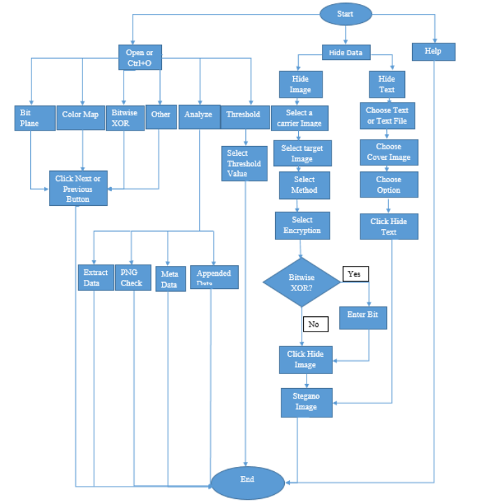

# Image-Steganography
 
A project on Image Steganography which involves implementation and analysis of different algorithms for hiding data such as text and images in images.This project was done during the course CSE4019 Image Procesing at Vellore Institute of Technology,Vellore.

<b>Architecture</b>

